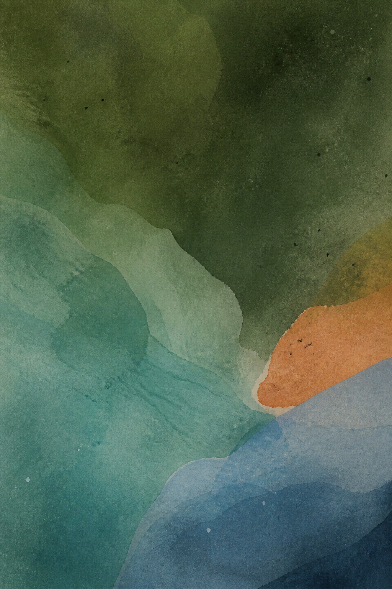
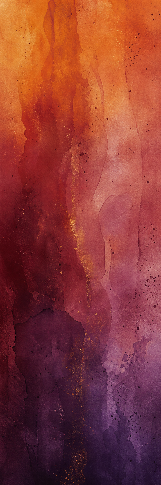

# paintmark 🎨📄
> browsers make lovely websites, but they make terrible print engines.

a lot of Markdown-to-PDF tools turn Markdown into HTML, wake up a browser, and ask it to print, or they turn it into LaTeX or Typst and print that instead. as a result, you (often) get terribly formatted garbage that ruins the simplicity that should be Markdown.

paintmark skips that whole parade and writes the PDF itself, no middleman, all in typescript

## smart-wrap

paintmark has two modes: `smart-wrap` and `blocked`. the former auto wraps words around images whenever possible, and the latter strictly preserves vertical order.



## some other things

- blank space is filled by random dots to make it feel less empty
- image alt text is auto presented as captions
- text is spaced accordingly to how related sections are. this makes lists, paragraphs, and headers look nice and are easy to ready
- sizing is done proportionally to the default font size

### math
equations and LaTeX render as you would expect, inline  $E = mc^2$ and $a_n = a_1 r^{n-1}$ and blocked:
$$
\int_0^\infty e^{-x^2} \, dx = \frac{\sqrt{\pi}}{2}
$$

and so do code
```ts
const renderer = createRenderer({
  config: { fontSize: 11, boldHeadings: true },
  imageResolver: createFetchImageResolver(fetch, document.baseURI),
});
const pdf = await renderer.pdf(markdown);
```

---

tables as well, duh!
| alpaca | mood | snack |
| --- | --- | --- |
| juniper | calm | hay |
| mochi | curious | apple |
| pepper | dramatic | grass |
### the wide view

Wide images use the content column instead of squeezing prose into a sad little strip.


## soo... why not print HTML?

the usual trip is Markdown → HTML → CSS → browser → print → PDF. It can work, but the result may depend on browser versions, font loading, print styles, and page-break rules, they also look nothing like the preview.

paintdown takes a shorter route: Markdown → measured layout → PDF. The preview draws the same page boxes used by the writer.

1. parse the document
2. measure the text
3. paginate the blocks
4. write the PDF bytes
---

## a tall order

tall images are capped by the usable page height. no stretching, squashing, or mysteriously enormous alpacas.



the aspect ratio stays intact as the page size and margins change. following prose can wrap beside the image, then returns to the full column for the next section.

## tiny character parade

curly quotes, em dashes, ellipses, and accents all get a turn: “hello,” one thing—then another… José, Zürich, naïve, façade, and Ångström.
